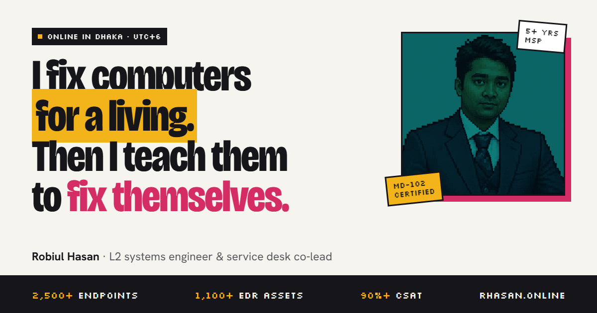
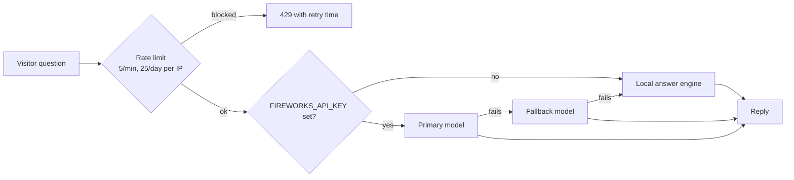

# rhasan.online

The personal site of **Robiul Hasan**: L2 infrastructure engineer and service desk co-lead by day, builder of SaaS products, store-published apps and AI tools the rest of the time.

**Live:** [rhasan.online](https://rhasan.online) · **Design:** "Dhaka Dispatch" · **Stack:** Astro 5, Tailwind CSS v4, Vercel



---

## What's on the site

| Page | What it shows |
| --- | --- |
| [`/`](https://rhasan.online) | Hero, Hermes spotlight, featured work, day-job stats, credentials |
| [`/projects`](https://rhasan.online/projects) | Filterable list of 8 projects, each with a case study |
| [`/skills`](https://rhasan.online/skills) | 7 skill domains with search, filters and proficiency levels |
| [`/experience`](https://rhasan.online/experience) | Work history timeline |
| [`/credentials`](https://rhasan.online/credentials) | Certifications and hackathon results |
| [`/about`](https://rhasan.online/about) | Background, principles and education |
| [`/contact`](https://rhasan.online/contact) | Email, WhatsApp, LinkedIn, GitHub |

### Projects featured

**Built at Thrive IT Solutions**
- **TimeBuddy**: workforce time and attendance SaaS with a native Windows agent. [Live](https://timebuddy.orderbuddy.pro/) · [Case study](https://rhasan.online/projects/timebuddy)
- **OrderBuddy**: courier dispatch SaaS for e-commerce (Pathao, RedX). [Live](https://orderbuddy.pro/) · [Case study](https://rhasan.online/projects/orderbuddy)
- **LedgerBuddy**: offline-first ledger, inventory and POS app. [Microsoft Store](https://apps.microsoft.com/detail/9NSR6DN33V8T) · [Google Play](https://play.google.com/store/apps/details?id=com.thriveitbd.ledgerbuddy) · [Case study](https://rhasan.online/projects/ledgerbuddy)
- **Equa**: private, double-entry personal finance app. [Microsoft Store](https://apps.microsoft.com/detail/9PM1MTHMCSGK) · [Case study](https://rhasan.online/projects/equa)

**Personal and client work**
- **NextVector**: daily tech and AI news with a frontier-model registry. [Live](https://nextvector.rhasan.online/) · [Case study](https://rhasan.online/projects/nextvector)
- **Hermes**: self-hosted, tool-calling AI assistant. [Case study](https://rhasan.online/projects/hermes)
- **LedgerBuddy AI MVP**: AMD AI Developer Hackathon (Act II) build. [Case study](https://rhasan.online/projects/ledgerbuddy-ai)
- **OGGRO Technologies**: static Next.js marketing site. [Live](https://www.oggro.tech/) · [Case study](https://rhasan.online/projects/oggro-tech)

---

## Tech stack

| Area | Choice |
| --- | --- |
| Framework | [Astro 5](https://astro.build), static output, one server route for chat |
| Styling | [Tailwind CSS v4](https://tailwindcss.com) via `@tailwindcss/vite`, design tokens in `src/styles/global.css` |
| Hosting | [Vercel](https://vercel.com) (`@astrojs/vercel` adapter) with Vercel Web Analytics |
| Scrolling | [Lenis](https://lenis.darkroom.engineering/) smooth scroll |
| AI chat | Fireworks AI chat completions, with a model fallback and a local answer engine |
| SEO | Open Graph and Twitter cards, JSON-LD, `@astrojs/sitemap`, `robots.txt`, [`llms.txt`](public/llms.txt) |
| Checks | `astro check` (TypeScript) |

---

## Design: "Dhaka Dispatch"

Inspired by Dhaka rickshaw art: flat, loud colour fills with hard ink outlines and offset shadows.

| Token | Hex | Used for |
| --- | --- | --- |
| Teal | `#0E7F80` | Primary buttons, links, section kickers |
| Pink | `#D42D65` | Highlights and accents |
| Marigold | `#F2B31B` | Spotlight tiles, CV button |
| Suit navy | `#1D2B4F` | Dark tiles |

- **Fonts:** Bricolage Grotesque (display), Hanken Grotesk (body), Silkscreen (pixel labels), IBM Plex Mono (code and tags)
- **Themes:** light and dark. A saved choice wins; otherwise the site follows the OS setting. Dark mode is the `html.dark` class.
- **Motion:** kept small. No cursor effects, 3D tilt or count-up animations.

---

## Hermes chat assistant

The "Ask Hermes" widget answers questions about Robiul's work. It is served by `src/pages/api/chat.ts`, the only non-static route.



- The system prompt is limited to Robiul's portfolio. It refuses generic coding, roleplay and prompt-injection attempts.
- Messages are capped at 350 characters. Replies aim for 70–130 words.
- Without an API key, the site still works: Hermes answers from a built-in keyword engine.

---

## Project structure

```text
.
├── public/
│   ├── Robiul_Hasan_CV.pdf      # CV linked from the header, hero and about page
│   ├── avatar/ avatar.png       # Pixel-art portraits
│   ├── favicon.svg              # Pixel "R" favicon
│   ├── og-image.png / .svg      # Social preview card (1200×630)
│   ├── llms.txt                 # Plain-text summary for AI crawlers
│   └── robots.txt
├── src/
│   ├── data/                    # All site content lives here
│   │   ├── dossier.ts           # Name, role, bio, contact, headline metrics
│   │   ├── projects.ts          # Projects and case-study copy (array order = list order)
│   │   ├── tones.ts             # Tile colour, tag and short blurb per project
│   │   ├── skills.ts            # Skill domains, levels, tags
│   │   ├── experience.ts        # Work history
│   │   └── credentials.ts       # Certifications
│   ├── components/              # Header, Footer, HermesChatWidget, SkillsMatrix,
│   │                            # CaseStudyHero, StackCard, ThemeToggle, SeoHead, …
│   ├── layouts/BaseLayout.astro # HTML shell, SEO head, theme script, Lenis, chat widget
│   ├── pages/
│   │   ├── index.astro, about.astro, skills.astro, experience.astro,
│   │   │   credentials.astro, contact.astro
│   │   ├── projects/            # index.astro + one page per case study
│   │   └── api/chat.ts          # Hermes chat endpoint (server-rendered)
│   └── styles/global.css        # Tailwind v4 theme tokens and component classes
└── astro.config.mjs             # Static output, Vercel adapter, sitemap
```

`src/pages/preview-dark.astro` and `preview-light.astro` are old design experiments. They are excluded from the sitemap.

---

## Run it locally

Requires Node.js 20 or newer.

```bash
npm install
```

```bash
npm run dev
```

The site runs at `http://localhost:4321`.

To test the live AI chat, copy `.env.example` to `.env` and add a [Fireworks AI](https://fireworks.ai/api-keys) key. Without it, Hermes uses the local answer engine.

```bash
FIREWORKS_API_KEY=your_fireworks_api_key_here
```

Before opening a PR, run the type check and a production build:

```bash
npx astro check
```

```bash
npm run build
```

---

## Common edits

| To change… | Edit |
| --- | --- |
| Bio, role, contact details, headline numbers | `src/data/dossier.ts` |
| Add or reorder a project | `src/data/projects.ts` (order), `src/data/tones.ts` (colour and blurb), then add `src/pages/projects/<slug>.astro` |
| Homepage project tiles | Set `featured: true` on up to 4 projects. If Hermes is featured, it is shown first as the spotlight (`spotlightId` in `src/pages/index.astro`). |
| Skills | `src/data/skills.ts` |
| CV | Replace `public/Robiul_Hasan_CV.pdf` (keep the file name) |
| Answers the chat gives | `SYSTEM_PROMPT` and `getLocalFallbackResponse` in `src/pages/api/chat.ts` |
| Summary for AI crawlers | `public/llms.txt` |

---

## Deployment

Vercel builds every push. `main` is the production branch for [rhasan.online](https://rhasan.online); other branches get preview URLs.

`main` is protected by GitHub rulesets:
- No direct pushes, force pushes or branch deletion.
- Changes land through a pull request, and the **Vercel** status check must pass.

Typical flow:

```bash
git switch -c my-change
```

```bash
git push origin my-change
```

Then open a pull request on GitHub, wait for Vercel, and merge.

Set `FIREWORKS_API_KEY` in **Vercel → Project → Settings → Environment Variables** to enable the live AI chat in production.

---

## License

© 2026 Robiul Hasan. All rights reserved. The code and content are not licensed for reuse.
